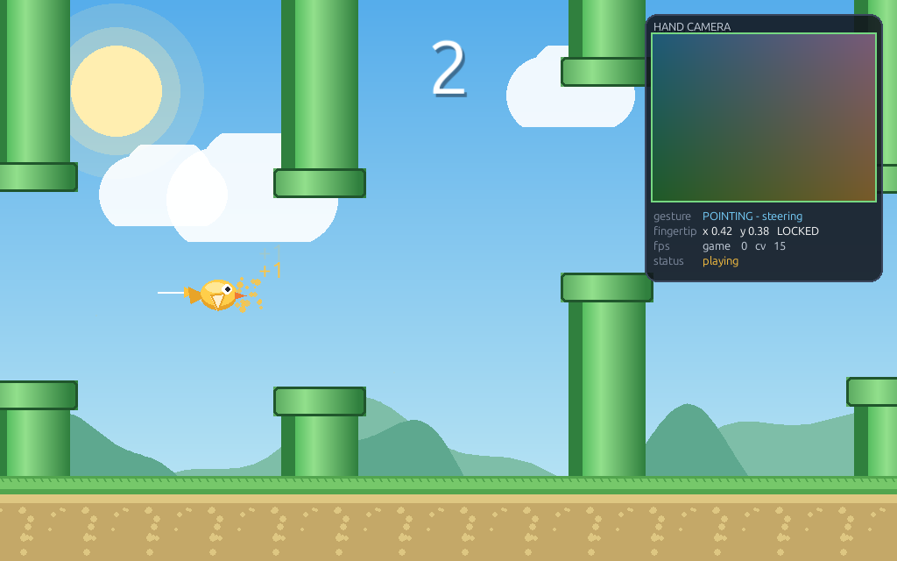
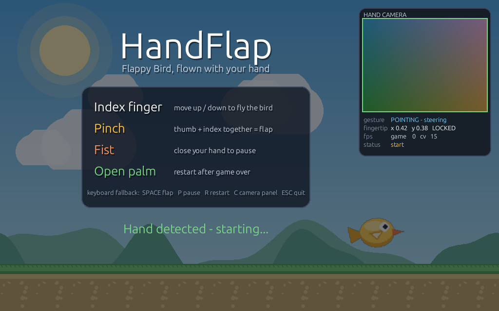
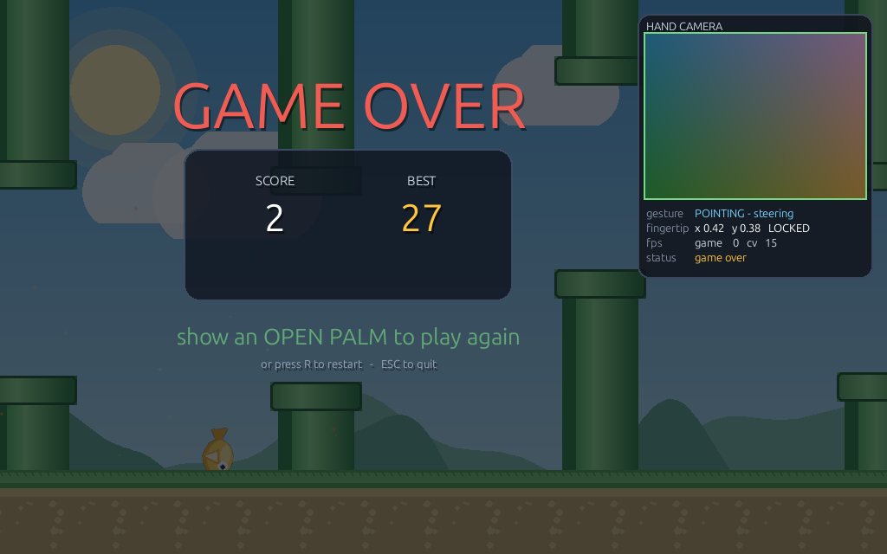
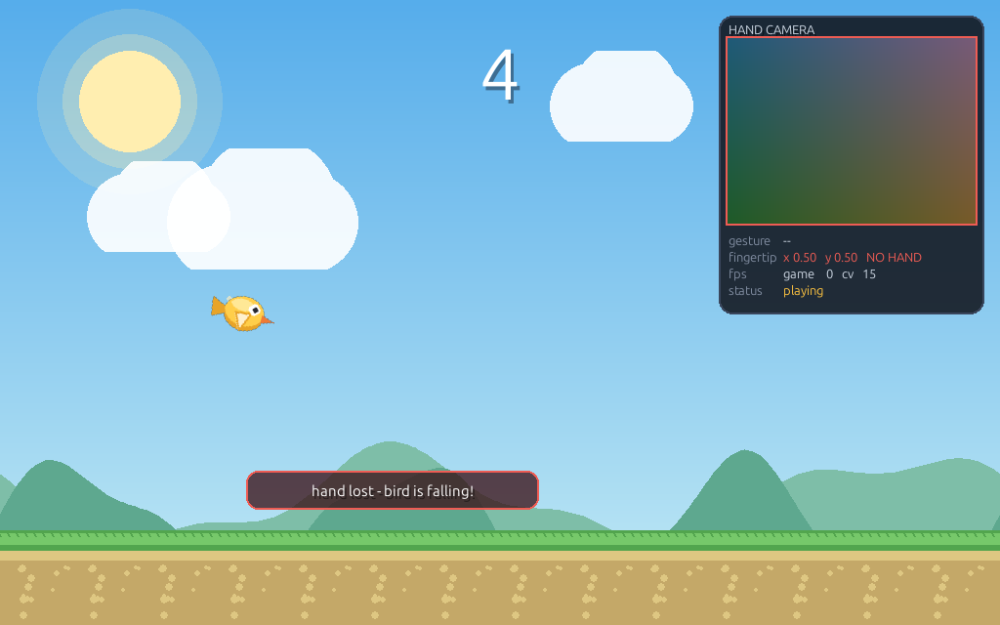

# HandFlap — a Flappy Bird you fly with your hand

[](https://www.python.org/downloads/)
[](LICENSE)

A 2D Flappy Bird–style game controlled entirely by a webcam. MediaPipe tracks
your hand, the index fingertip steers the bird, and pinch / fist / open-palm
gestures handle flapping, pausing and restarting. No keyboard or mouse
required, no cloud services, everything runs locally.

All artwork is generated procedurally with Pygame drawing primitives — there
are no Flappy Bird assets in this project.



<table>
<tr>
<td></td>
<td></td>
</tr>
<tr>
<td align="center"><em>Start screen — show a hand to begin</em></td>
<td align="center"><em>Game over — open palm to replay</em></td>
</tr>
</table>

Lose tracking mid-flight and gravity takes over immediately — the panel border
turns red and the bird starts falling:



---

## 1. Requirements

**Software**

| | |
|---|---|
| Python | 3.9 – 3.12 |
| OS | Linux, macOS or Windows |
| Packages | `mediapipe`, `opencv-contrib-python`, `pygame`, `numpy` |

**Webcam**

* Any built-in or USB webcam that OpenCV can open.
* 640×480 @ 30 FPS is plenty; the game requests that and downscales to 320 px
  wide for inference. 15 FPS cameras work fine — the game still renders at 60.
* Reasonable lighting, with your hand 40–100 cm from the camera and your
  whole hand inside the frame.

---

## 2. Installation

```bash
git clone https://github.com/USERNAME/handflap.git
cd handflap

python3 -m venv .venv
source .venv/bin/activate          # Windows: .venv\Scripts\activate

pip install --upgrade pip
pip install -r requirements.txt

python download_model.py           # one-time ~7.5 MB model download
```

Check that everything works before you start waving at your laptop:

```bash
python selftest.py
```

It verifies the dependencies, the model, gesture geometry, a full headless game
round and your camera — no display required, so it also works over SSH. Add
`--no-camera` to skip the camera probe.

`download_model.py` fetches `hand_landmarker.task` into `models/`. Modern
MediaPipe ships the Tasks API without weights, so this happens once at setup —
the game itself never touches the network. `main.py` will download it
automatically on first launch if you skip this step.

Air-gapped machine? Download the file on another computer from the URL printed
by the script and drop it in `models/hand_landmarker.task`.

---

## 3. Running

```bash
source .venv/bin/activate          # Windows: .venv\Scripts\activate
python main.py
```

Options:

```bash
python main.py --camera 1          # use a different webcam
python main.py --no-camera         # keyboard-only mode (no CV at all)
python main.py --no-panel          # start with the webcam panel hidden
```

Copy-paste, from clone to playing:

```bash
git clone https://github.com/USERNAME/handflap.git && cd handflap && \
python3 -m venv .venv && source .venv/bin/activate && \
pip install --upgrade pip && pip install -r requirements.txt && \
python download_model.py && python main.py
```

---

## 4. Hand controls

| Gesture | Action |
|---|---|
| ☝️ **Index finger up / down** | The bird flies toward your fingertip height |
| 🤏 **Pinch** (thumb + index touching) | Flap — an upward impulse |
| ✊ **Fist** (all fingers closed) | Pause / resume |
| 🖐️ **Open palm** (all five fingers spread) | Restart after game over |
| Show your hand on the title screen | Starts the game |

Only the **middle vertical band** of the camera frame maps to the playfield
(18 %–82 %, drawn as two green lines in the preview), so you never have to
reach to the edge of the frame. The mapping is absolute: the top of the band is
the top of the screen.

The bird does not snap to your finger — it accelerates toward it and carries
momentum, so it feels like flying rather than dragging. Lose tracking and
gravity takes over immediately, which is deliberate: it keeps the game honest
when your hand leaves the frame.

**Keyboard fallback** (always active, handy for testing):
`SPACE` flap · `P` pause · `R` restart · `C` toggle webcam panel · `ESC` quit

---

## 5. The webcam panel

Top-right corner, toggled with `C`. It shows:

* the mirrored camera feed with the 21 hand landmarks and skeleton drawn on it,
* a cyan ring on the **smoothed** index fingertip,
* the two green lines bounding the active control band,
* the currently detected gesture,
* fingertip coordinates and whether the hand is `LOCKED` or `NO HAND`,
* both frame rates — `game` (render loop) and `cv` (camera + inference),
* the game state.

The border is green when a hand is tracked, amber during the grace period after
it disappears, red when tracking is lost.

---

## 6. Architecture

```
handflap/
├── main.py            entry point, CLI args, pygame bootstrap
├── game.py            state machine, game loop, input → gameplay glue
├── hand_tracker.py    camera + MediaPipe on a background thread  ← CV layer
├── gestures.py        landmark geometry → gesture names          ← CV layer
├── player.py          bird physics and procedural animation
├── obstacles.py       pipes, difficulty curve, collision
├── background.py      procedural parallax scenery
├── effects.py         particles, floating text, screen shake
├── hud.py             score, webcam panel, menus and overlays
├── settings.py        every tunable constant
├── download_model.py  one-time model fetch
├── requirements.txt
├── models/            hand_landmarker.task (downloaded)
└── highscore.json     created on first game over
```

### The one rule

**Computer vision never touches game state, and game logic never touches
OpenCV.** The two halves meet at exactly one place: a `HandState` dataclass.

```
   ┌──────────────── hand-tracker thread ────────────────┐
   │  camera → mirror → downscale → MediaPipe →          │
   │  select hand → smooth → classify gesture →          │
   │  publish HandState                                  │
   └──────────────────────┬──────────────────────────────┘
                          │  (lock-protected snapshot)
   ┌──────────────────────▼──────────────────────────────┐
   │  main thread: game.update(dt) reads HandState,       │
   │  applies it to the bird, renders at 60 FPS           │
   └──────────────────────────────────────────────────────┘
```

`gestures.py` imports nothing but NumPy — it is pure geometry over a
`(21, 3)` landmark array, so it can be tested without a camera. `game.py`
imports no CV libraries at all, which is why `--no-camera` works.

### Why a thread

The camera delivers 15–30 FPS and MediaPipe inference costs ~25 ms per frame.
Calling that from the game loop would cap rendering at the camera's rate and
make everything stutter. Instead the CV pipeline runs independently and
publishes its latest result; the game samples whatever is current. Rendering
stays at 60 FPS regardless of what the camera is doing, and the smoothed
fingertip target hides the rate mismatch.

---

## 7. How the computer-vision part works

**1 — Capture.** `cv2.VideoCapture` opens the camera, preferring the V4L2
backend on Linux and falling back to whatever OpenCV offers. `CAP_PROP_BUFFERSIZE`
is set to 1 so each read returns the newest frame rather than replaying a queue
of stale ones, which would show up as control lag. The frame is mirrored
in-place (`cv2.flip(frame, 1, dst=frame)`) so moving your hand left moves it
left on screen.

**2 — Downscale for inference.** The frame is resized to 320 px wide before
being handed to MediaPipe. Landmark accuracy barely changes, and the cost drops
roughly with the pixel count. The preview panel gets its own small resize; the
full-resolution frame is never copied unnecessarily.

**3 — Landmark detection.** MediaPipe returns 21 landmarks per hand in
normalised `[0, 1]` coordinates. Two front-ends are supported behind one
interface: the current Tasks API (`HandLandmarker` in VIDEO mode, which needs
strictly increasing timestamps) and the legacy `mp.solutions.hands` graph for
older installs. Both produce the same `(21, 3)` array, so nothing downstream
knows or cares which one ran.

**4 — Coordinate normalisation.** Two separate normalisations matter here:

* *Aspect correction.* Normalised coordinates squash a 4:3 frame into a unit
  square, so raw Euclidean distances between landmarks are distorted. Before
  any geometry, `x` is multiplied by the frame's aspect ratio.
* *Scale invariance.* Every gesture threshold is divided by the palm length
  (wrist → middle knuckle). A pinch is "thumb and index closer than 0.42 palm
  lengths", not "closer than 30 pixels", so the thresholds hold whether you sit
  near the camera or far from it.

**5 — Choosing one hand.** With several hands in frame, the one nearest to the
fingertip tracked last frame wins, so a second hand entering the shot cannot
steal control mid-flight. With nothing to continue from, the largest hand wins —
the person reaching toward the camera is the one asking to play. MediaPipe's
handedness score is deliberately *not* used for this: it rates left-vs-right
classification confidence and sits near 1.0 for every hand.

**6 — Smoothing.** The fingertip runs through a **One Euro filter**. A fixed
low-pass filter forces a choice between jitter and lag; the One Euro filter
widens its cutoff as the signal speeds up, so a still hand gets heavy smoothing
while a fast flick passes through nearly untouched. Measured on synthetic
noise, it cuts frame-to-frame jitter by roughly 6×.

**7 — Gesture classification** (`gestures.py`, pure geometry):

* *Finger extension* — a finger counts as extended when its tip is further from
  the wrist than its PIP joint, by a margin. This ratio test is rotation
  invariant, unlike the common `tip.y < pip.y` shortcut, which breaks the
  moment you tilt your hand.
* *Thumb* — it bends sideways, so the wrist-distance test doesn't apply.
  Its distance to the pinky knuckle measures abduction instead.
* *Pinch* — thumb-tip to index-tip distance over palm length, with **Schmitt
  trigger hysteresis**: it closes at 0.42 and only releases at 0.60, so the
  classification cannot flicker while you hover at the threshold. A closed fist
  also puts the thumb near the index tip, so a pinch additionally requires the
  index to be *reaching away* from the wrist.
* *Fist* — at most one finger extended, index not reaching out.
* *Open palm* — at least four fingers extended.

**8 — Debouncing.** Two layers. A gesture must repeat for 3 consecutive frames
before it is committed as the stable gesture. Discrete actions (flap, pause,
restart) are then **edge-triggered** with a 0.55 s cooldown, so *holding* a
pinch fires one flap, not sixty per second.

**9 — Control mapping.** The smoothed `y` is remapped through the active band
(18 %–82 %) to `0..1`, then to a target height in the playfield. A small
deadzone ignores sub-pixel tremor.

**10 — Handling failure.** Every failure mode is handled explicitly:

| Situation | Behaviour |
|---|---|
| No hand detected | 0.35 s grace period keeps the last target (covers single-frame dropouts), then control is released and the bird falls under gravity, with an on-screen warning |
| Several hands | Continuity-based selection picks exactly one (above) |
| Hand leaves and returns | Filters reset after the grace period so the bird doesn't snap from a stale position |
| Camera won't open | Game starts anyway in keyboard mode with the reason shown in the panel |
| MediaPipe missing / model missing | Same — keyboard mode, message displayed |
| Camera unplugged mid-game | 60 consecutive failed reads → keyboard mode, game keeps running |
| CV thread crashes | Caught and reported; the game loop is untouched |

The game is *never* blocked or killed by a camera problem.

---

## 8. Gameplay details

* **Physics** — gravity is always applied. While your hand is guiding, ~78 % of
  it is cancelled and a proportional controller drives velocity toward your
  fingertip; lose tracking and full gravity returns instantly.
* **Collision** — circle-vs-rectangle against a hitbox 78 % of the drawn bird,
  so clipping a pipe corner doesn't feel unfair.
* **Difficulty** — pipe speed 210 → 400 px/s, gap 215 → 150 px, spacing
  330 → 250 px as your score climbs. A "SPEED UP!" banner marks every 5 points.
* **Fairness** — consecutive gap centres never jump more than 170 px, so no
  gap is unreachable from the previous one.
* **High score** — stored in `highscore.json` next to the source. A corrupt or
  unwritable file degrades to "no record yet" instead of crashing.

---

## 9. Troubleshooting

**"camera N could not be opened"**
Another application is probably holding the camera (video call, browser tab).
Close it. Try another index: `python main.py --camera 1`. On Linux check
`ls /dev/video*` — some webcams expose a metadata node as `video1`, so `video0`
is usually the right one.

**Hand not detected**
Improve the lighting, especially avoid a bright window behind you — a
backlit hand becomes a silhouette. Get your whole hand in frame, palm toward
the camera, 40–100 cm away. Watch the panel: if the skeleton doesn't appear,
detection is the problem, not the game.

**Bird jitters / feels twitchy**
Lower `EURO_MIN_CUTOFF` in `settings.py` (try `0.8`) for more smoothing.

**Bird feels sluggish / laggy**
Raise `EURO_MIN_CUTOFF` (try `1.6`) and `EURO_BETA` (try `0.05`), or raise
`FOLLOW_RESPONSE`.

**Pinch triggers accidentally / never triggers**
Adjust `PINCH_ON` (lower = must pinch tighter) and keep `PINCH_OFF` above it —
the gap between them is the anti-flicker hysteresis.

**Can't reach the top or bottom of the screen**
Widen the control band: `CONTROL_TOP = 0.12`, `CONTROL_BOTTOM = 0.88`.

**Low `cv` FPS in the panel**
Below ~12 FPS control gets mushy. Lower `DETECT_WIDTH` to 256, or set
`MAX_NUM_HANDS = 1`. Note many laptop webcams drop to 15 FPS in dim light
because auto-exposure lengthens exposure time — more light genuinely helps.
Game FPS is independent of this and should stay at 60.

**`ModuleNotFoundError: No module named 'cv2'`**
The virtualenv isn't active, or install `opencv-contrib-python`. Do not install
`opencv-python` and `opencv-contrib-python` together — they both provide `cv2`
and will conflict. MediaPipe depends on the contrib build.

**"hand_landmarker.task missing"**
Run `python download_model.py`.

**Game window is black or won't open (Linux/SSH)**
Pygame needs a display. `SDL_VIDEODRIVER=dummy` runs headless but shows
nothing — you need a real desktop session.

---

## 10. Tuning

Everything lives in `settings.py`: window size, physics constants, difficulty
curve, gesture thresholds, filter parameters, control band and colours. The
file is grouped by subsystem and every value is commented.

---

## 11. Contributing

Issues and pull requests are welcome. Before opening a PR, run:

```bash
python selftest.py
```

Please keep the layering intact — `gestures.py` stays pure geometry (NumPy
only), and `game.py` must not import OpenCV or MediaPipe. That separation is
what makes the game testable without a camera and playable without one.

---

## 12. License

[MIT](LICENSE) — do what you like with it.

The bundled artwork is generated procedurally by the code itself; no third-party
game assets are included. The hand landmark model downloaded at setup time is
Google's, distributed under the
[Apache 2.0 license](https://developers.google.com/mediapipe/solutions/vision/hand_landmarker)
and is not redistributed by this repository.
